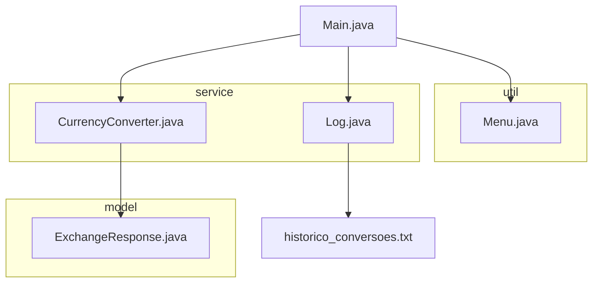

# 💱 Conversor de Moedas - Java 22 (Orientação a Objetos)

Este projeto é um conversor de moedas desenvolvido em **Java 22**, utilizando **GSON para leitura de JSON**, consumo de API HTTP e programação orientada a objetos. A aplicação permite ao usuário realizar conversões entre moedas, consultar um histórico salvo em arquivo `.txt`, e repetir a operação conforme sua escolha.

---

## 📌 Funcionalidades

- ✅ Menu com opções de conversão (USD, BRL, EUR, JPY)
- ✅ Consumo da [ExchangeRate API](https://www.exchangerate-api.com/)
- ✅ Registro de histórico em arquivo `.txt`
- ✅ Estrutura orientada a objetos, com separação por camadas
- ✅ Suporte a múltiplas conversões com laço interativo

---

## 📁 Estrutura de Pastas

```bash
ConversorDeMoedas/
├── historico_conversoes.txt         # Arquivo de log gerado automaticamente
└── src/
    ├── Main.java                    # Classe principal (ponto de entrada)
    ├── model/
    │   └── ExchangeResponse.java    # Modelo para mapear JSON da API
    ├── service/
    │   ├── CurrencyConverter.java   # Lógica de conversão usando a API
    │   └── Log.java                 # Registro e leitura do histórico
    └── util/
        └── Menu.java                # Interface textual com o usuário
```

---

## 🧭 Diagrama da Arquitetura (Mermaid)



> 💡 Visualização: `Main` orquestra todas as interações, usando `Menu` para entrada do usuário, `CurrencyConverter` para chamar a API, `Log` para gravar e ler histórico, e `ExchangeResponse` para mapear o JSON retornado.

---

## 📚 Descrição das Classes

| Classe | Localização | Função |
|--------|-------------|--------|
| `Main` | `/src` | Ponto de entrada do programa. Controla o fluxo principal. |
| `Menu` | `/src/util` | Exibe o menu, recebe entrada do usuário e interpreta escolhas. |
| `CurrencyConverter` | `/src/service` | Conecta à API de câmbio, lê a taxa e realiza cálculo da conversão. |
| `Log` | `/src/service` | Registra conversões com data/hora e exibe histórico gravado. |
| `ExchangeResponse` | `/src/model` | Representa a resposta da API (GSON usa para converter JSON). |

---

## 🌐 API Utilizada

- **ExchangeRate API**
- Endpoint:
  ```
  https://v6.exchangerate-api.com/v6/{API_KEY}/latest/{base_code}
  ```
- Exemplo com chave:
  ```
  https://v6.exchangerate-api.com/v6/d84574b3382cddf9f67ae33d/latest/USD
  ```

---

## 💾 Exemplo de Histórico

```txt
[2025-06-03 14:22:10] 100.00 USD -> 535.20 BRL
[2025-06-03 14:30:42] 50.00 BRL -> 9.18 USD
```

---

## 🛠️ Como Executar

1. Clone o repositório:
   ```bash
   git clone https://github.com/seu-usuario/ConversorDeMoedas.git
   ```

2. Abra no IntelliJ IDEA ou outro ambiente compatível com Java 22.

3. Adicione o `.jar` da biblioteca GSON ao classpath do projeto.

4. Execute a classe `Main.java`.

---

## 🚀 Melhorias Futuras (Ideias)

- [ ] Permitir entrada de qualquer código de moeda (sem menu fixo).
- [ ] Exportar histórico para `.csv` ou banco de dados.
- [ ] Interface gráfica (Swing/JavaFX).
- [ ] Uso de padrões de projeto (Strategy, Singleton etc).

---

## 🧑‍💻 Autor

Desenvolvido com fins educacionais para prática de **Java Backend** com foco em **POO**, consumo de APIs e persistência de dados local.

---

## 📜 Licença

Este projeto é livre para uso educacional. Modifique, melhore e compartilhe como quiser. 🚀
